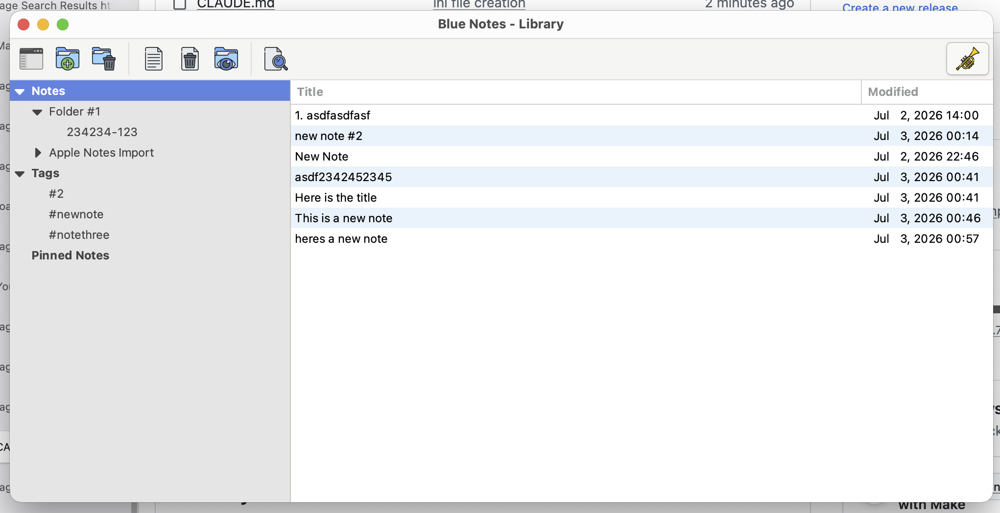

# Blue Notes

Blue Notes is our take on an Apple Notes–style app, coded in classic C
with GTK3 and SQLite — with the help of Claude Code for edits, testing,
and code organization. No web view, no framework of the week — it
starts fast, stays out of your way, and runs the same on macOS and
Linux. We built it because we wanted it, and we're pretty happy with
how it turned out.



Here's the shape of it: your notes live in a single SQLite file you can
take anywhere. You organize them in a Library window — nested folders
and `#tags` in the sidebar, notes as a list or a grid of thumbnails —
and each note opens in its own Editor window. The editor is proper
WYSIWYG rich text: inline styles, headings, lists, task checkboxes,
tables, code blocks (with a copy button, of course), and inline images
pasted straight from the clipboard. When you want your notes elsewhere,
they export to HTML or Markdown. And if you'd rather script it, the
command line does everything too — it even chats with a running GUI
over a unix socket so the two never step on each other.

Want more detail?

- **[User Guide](User_Guide.md)** — everything in depth: the library,
  editor, search, settings, storage & backup, export, and the
  command-line interface.
- **[Internals](Internals.md)** — for the curious: code layout, the
  database schema, and the BNBF note format.

## Migrating from Apple Notes

Coming from Apple Notes? We were too. Bring everything with you:

```sh
tools/import-apple-notes.sh
```

This exports every folder and note from Notes.app (macOS asks once for
permission to control Notes), converts the bodies to text, saves image
attachments, and imports the lot — hierarchy included — under an
"Apple Notes Import" folder. Your notes even keep their original
last-edited dates. A couple of honest caveats: images land at the end
of each note (Notes' scripting interface won't tell us where they were
inline), and non-image attachments like PDFs and scans are skipped with
a count. Re-running the script duplicates notes, so delete the import
folder first if you want a do-over.

## Building

You'll need a C compiler, the GTK3 and SQLite3 development files, and
pkg-config. That's it. (librsvg is optional — the toolbar icons are
PNGs; it only sharpens the few remaining SVG icons, which otherwise
fall back to text glyphs and GTK's built-in raster icons.)

macOS (MacPorts):

```sh
sudo port install pkgconf gtk3 +quartz librsvg
sudo port install gtk-osx-application-gtk3   # optional: native menu bar
make
make run
```

Debian/Ubuntu:

```sh
sudo apt install build-essential pkg-config libgtk-3-dev libsqlite3-dev \
                 librsvg2-common
make
make run
```

The Makefile auto-detects `gtk-mac-integration-gtk3`; if you install it
later, rebuild from clean (`make clean && make`) so every file sees it.

Enjoy — we hope it becomes part of your day the way it has ours.
